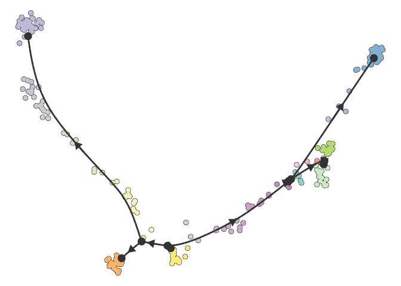
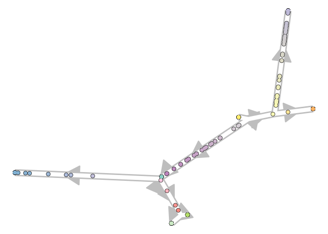
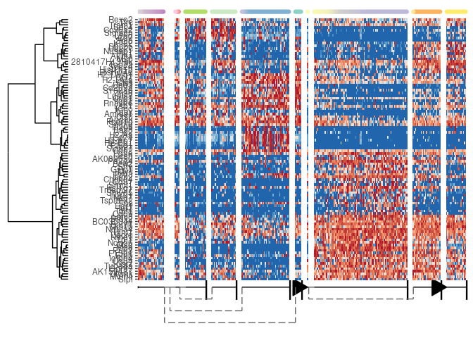

example
================

## Example trajectory output

``` r
library(tidyverse)
library(magrittr)
library(dyno)
set.seed(1)
```

Load data and wrap it as a dyno object.

``` r
expression <- SCORPIUS::ginhoux$expression
counts <- 2^expression - 1 # I'm cheating because there is no counts data anymore

dataset <-
  wrap_expression(expression = expression, counts = counts)
```

Infer a trajectory with a certain TI method

``` r
trajectory <-
  infer_trajectory(dataset, ti_projected_monocle(max_components = 3)) %>% 
  simplify_trajectory() %>% 
  add_root()
```

    ## root cell or milestone not provided, trying first outgoing milestone_id

    ## Using 'M1' as root

We can plot it using some of the dynplot functions:

``` r
plot_dimred(trajectory)
```

    ## Coloring by milestone

    ## Using milestone_percentages from traj

<!-- -->

``` r
plot_graph(trajectory)
```

    ## Coloring by milestone
    ## Using milestone_percentages from traj

<!-- -->

``` r
plot_heatmap(trajectory, expression_source = dataset, label_milestones = FALSE, features_oi = 100)
```

    ## No features of interest provided, selecting the top 100 features automatically

    ## Using dynfeature for selecting the top 100 features

    ## Coloring by milestone

<!-- -->

Milestone network: required

``` r
trajectory$milestone_network %>% write_tsv("data/milestone_network.tsv")
trajectory$milestone_network
```

    ##    from  to      length directed
    ## 1    M1 M11  7.30934720     TRUE
    ## 2   M11 M12  0.20138037     TRUE
    ## 3   M12  M2  4.00245343     TRUE
    ## 4    M2  M6  0.32161961     TRUE
    ## 5    M2  M7  1.01602611     TRUE
    ## 6   M12  M9  6.51243709     TRUE
    ## 7   M11  M8  0.05768709     TRUE
    ## 8    M1  M5  1.40462406     TRUE
    ## 9    M5 M10 10.84609563     TRUE
    ## 10   M5  M3  1.96587616     TRUE
    ## 11   M1  M4  0.52530866     TRUE

Milestone percentages:
required

``` r
trajectory$milestone_percentages %>% write_tsv("data/milestone_percentages.tsv")
trajectory$milestone_percentages %>% head()
```

    ##      cell_id milestone_id percentage
    ## 1 SRR1558744           M5  0.7386932
    ## 2 SRR1558745           M1  0.0000000
    ## 3 SRR1558746           M1  0.2919272
    ## 4 SRR1558747           M1  0.4949958
    ## 5 SRR1558748           M1  0.8946664
    ## 6 SRR1558749           M3  1.0000000

Divergence regions:
optional

``` r
trajectory$divergence_regions %>% write_tsv("data/divergence_regions.tsv")
trajectory$divergence_regions
```

    ## # A tibble: 0 x 3
    ## # ... with 3 variables: divergence_id <chr>, milestone_id <chr>,
    ## #   is_start <lgl>

Dimred:
optional

``` r
trajectory$dimred %>% as.data.frame %>% rownames_to_column("cell_id") %>% write_tsv("data/dimred.tsv")
trajectory$dimred %>% head()
```

    ##                comp_1    comp_2    comp_3
    ## SRR1558744 -4.9197020 -1.648438 0.8395830
    ## SRR1558745 -1.0700792 -4.718646 1.6316734
    ## SRR1558746  3.6885199 -2.414410 0.4862828
    ## SRR1558747  2.4459313 -3.362719 0.4684837
    ## SRR1558748 -0.6610742 -3.180193 0.8077080
    ## SRR1558749 -4.5849153 -5.074266 2.0250243

Dimred milestones:
optional

``` r
trajectory$dimred_milestones %>% as.data.frame %>% rownames_to_column("cell_id") %>% write_tsv("data/dimred_milestones.tsv")
trajectory$dimred_milestones %>% head()
```

    ##       comp_1     comp_2    comp_3
    ## M1 -1.336861 -3.5135573  0.990837
    ## M2  7.089120 -0.7731292 -3.608518
    ## M3 -4.259900 -4.4439097  1.610909
    ## M4 -1.327115 -4.0301267  1.085759
    ## M5 -2.723079 -3.3233610  1.114004
    ## M6  7.259305 -0.6189499 -3.833696

Dimred segments: optional

``` r
# this method did not return dimred_segments so I'm manually
# creating an example table.
milnet <- trajectory$milestone_network
dimmil <- trajectory$dimred_milestones

dimred_segments <- 
  crossing(
    milnet %>% select(from, to),
    pct = seq(0, 1, by = .1)
  )

for (col in colnames(dimmil)) {
  dimred_segments[,col] <- dimmil[dimred_segments[,"from"], col] * (1-dimred_segments[,"pct"]) + dimmil[dimred_segments[,"to"], col] * dimred_segments[,"pct"]
}

dimred_segments %>% write_tsv("data/dimred_segments.tsv")
dimred_segments %>% head()
```

    ##   from  to pct      comp_1    comp_2    comp_3
    ## 1   M1 M11 0.0 -1.33686081 -3.513557 0.9908370
    ## 2   M1 M11 0.1 -0.65607100 -3.278633 0.9078037
    ## 3   M1 M11 0.2  0.02471881 -3.043708 0.8247704
    ## 4   M1 M11 0.3  0.70550862 -2.808783 0.7417371
    ## 5   M1 M11 0.4  1.38629843 -2.573859 0.6587038
    ## 6   M1 M11 0.5  2.06708824 -2.338934 0.5756704

Order of milestones:
    optional

``` r
trajectory$milestone_ids
```

    ##  [1] "M1"  "M2"  "M3"  "M4"  "M5"  "M6"  "M7"  "M8"  "M9"  "M10" "M11"
    ## [12] "M12"
